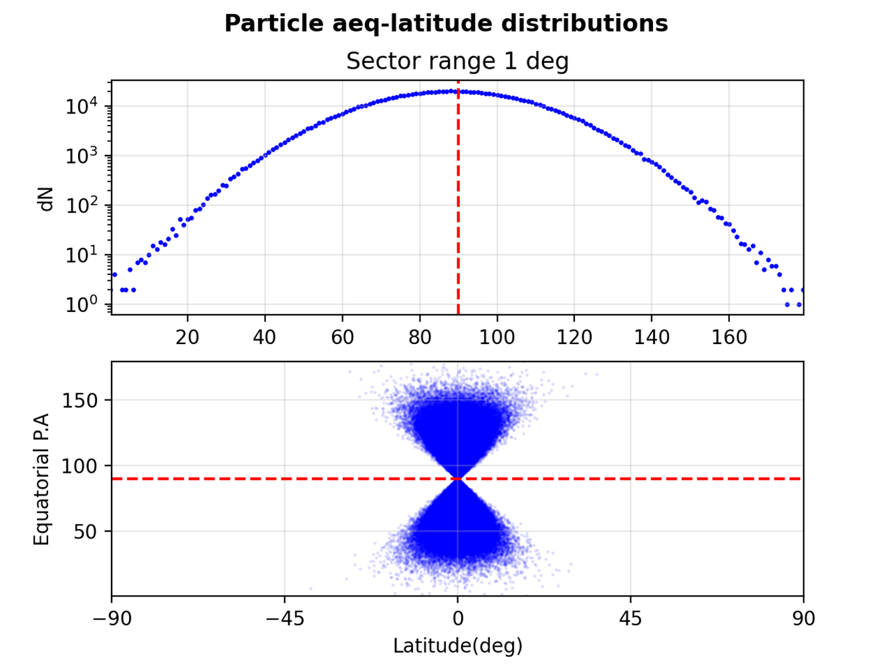
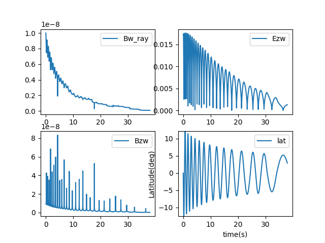
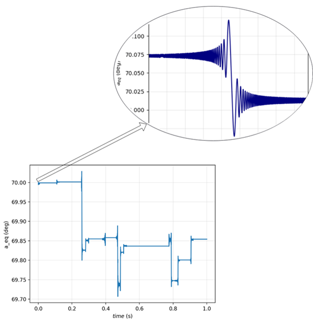
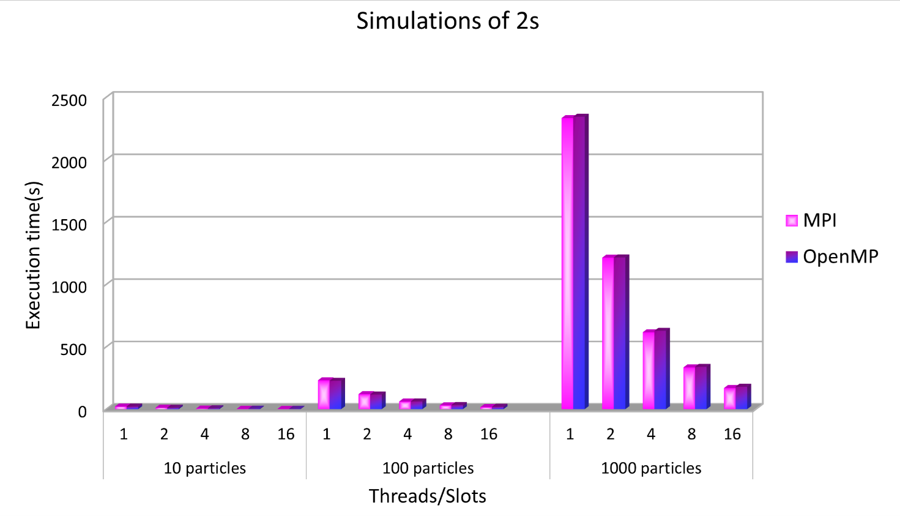
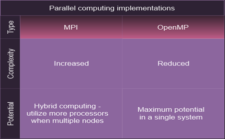
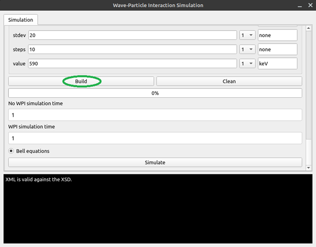
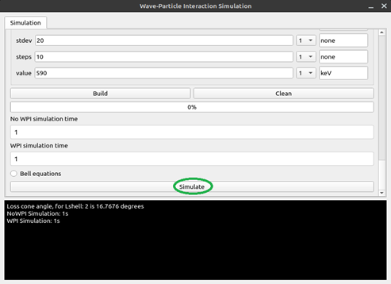
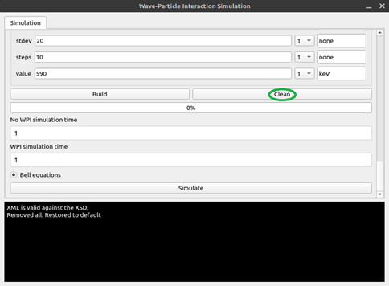

# Simulation of Wave-Particle Interaction with Parallel Processing
## Table of Contents
- [Documentation](#documentation)
- [Features](#features)
- [Workflow](#workflow)
- [Distribution](#distribution)
- [Adiabatic Motion](#adiabatic-motion)
- [Satellite](#satellite)
- [RK4](#rk4)
- [Ray](#ray)
- [WPI](#wpi)
- [Parallelism](#parallelism)
    - [MPI](#mpi)
    - [OpenMP](#openmp)
- [Installation](#installation)
- [GUI](#gui)
- [CLI](#cli)
- [Acknowledgments](#acknowledgements)


## Documentation 
The thesis document in English
- [Documentation](./doc/CharitonV_2023.pdf)

## Features 
- Generate various **particle distributions**
- **Parallel execution (C++ with OpenMP or MPI)** 
- Post-processing and Visualization in **Python**
- **PyQt GUI application** to configure - simulate - visualize 

The effects of various propagating Electromagnetic Waves over different particle distributions are evident.

## Workflow
**Click on the enriched flow diagram** to browse through the code in Git.

[](https://viewer.diagrams.net/?tags=%7B%7D&highlight=0000ff&edit=_blank&layers=1&nav=1&title=Untitled%20Diagram.drawio#R7V1rd5s4E%2F41PmffD%2FbhbvwxTuu223abJr1s90sONorNFiMWcBL317%2BSuCMBMgaMU3t3s0YYIWlmnhmNpJmRfL19fuMZ7uYjNIE9kgTzeSS%2FGkmSpknoLy7YRwWiGhasPcsMi4S04M76BcLCWVS4s0zgh0ViWBRAaAeWmy9cQccBqyBXZngefMr%2F7AHaZq7ANdaAKrhbGTZd%2Bt0yg01YqkvTtPwtsNab%2BM2iFjV8aax%2Brj24c6L3OdAB4Z2tEVcTddzfGCZ8yhTJr0fytQdhEH7bPl8DGw9qPGDf3%2B2%2F2x9%2Bam%2F%2B%2FOz%2FZ3ydv%2F%2Fy17dxWNnikEeSznnACRpX%2Fe%2Fs1v2oCJ%2FnEvwHPTlzvi2dsaSHdT8a9i4aypGk2egt86WH%2BxzsoyHW%2Ftvhjs4foBOMfUL%2FK%2FQD3UUcNE9vo2%2Fr6P%2Bklp3dRi22dUwtDnhCd23oB%2BEoBtbKRszaaj%2FRuONGttls3wgQBa0AjFce9H1g5lsv%2BMYjKbMc9OfTq5sv5GXeDonX0LsWUsQPUA%2FR%2F%2BFDz3RBhZgv40Ip9yIpAM9k%2BAMP%2FgTX0IYeKie4gN5u2XahaBNsbXQloq9PG0StO9dY4ZqeEM6iskeA%2B2XYV7a1dlDx1jJN%2FKY5RHcebAIoG1QGnKhzEbbq0WX8tpEkC%2BSDH0WvsAKM1DMh6UEtPEQwghsEnjOwGcHFGwC3IPD26CfRXVnUJtNIDURqQZGnEykqekqBVpxGGLnJgOws%2Bp0RYfs6eUGKUuhLBFSHgNa0FLT44aYFrKGqiHmYdKABI3clglS9hu0Bw9y3goq9NfpIiOutnW3B2gXTOsA0URYpTFM1GtBi8zcLaOp00gKk3Y%2F9f3bO1zm8%2B2YuPu%2Bm0%2Bdv78eyQJEMmMjCjS4jshA7FeB6yIh5wQauoWPYHyB0I3L9C4JgHw23sQtgnpjg2Qr%2Bjh7H33%2Fg76hT4dWr58ytV%2Fv4wkEd%2FDv9Ib78kb2XPkau4ucydBelgynqw523AhW%2Fk6NZhuGtQVTfj%2Feu%2F7fyFuor736sfnQ%2B73beWI1%2BiIezkkE8YBuB9ZifULAITR698jxjn%2FmBCy0n8DM13%2BCCDN9pFN8hVizwTVhpykVJ67gYq2qYGKrStB6LGGJghvfAQw6ZNkGAJ3FXuKHSYm0Fm91ysoJbdPHN8K3VxvBE1JHFTYR04y8ekmRnPX6NCjboxtKGS9x2AxuqC99bob9obIDnQjziEJfeInV0f2vs7797CG4mqxWNfqyfxMhnMNAw17%2BCbKWCVAZxGaEpMvLaNnw%2FYvIQUOMpJ%2F51MksUCtCKwO5Bxf9QOIzuaORDw2P46RIPBYovdQYcSgz7ThU6AkNF7xcMEwD8kblzVmA45QVDtW0w5CV0VbOHBk6mheTTWu4ibMpeMpGJ%2FkEpLmHr76yQqgyPyhGsK6RS1JMiFVOeFK0SqVJQep2Wnga4jgOgWmBROjGyKCtKlimPhDTT8rWEYBk9WKDvYQYV0%2FkwPSXFxVG%2FdvvhlkdWVVVxSpajmOPcutl%2BlMtJrJ6fdS3ovw%2FZ9VORvarV1QaKbd0%2FudhdNJpe438lYYmqDsuaav0N3C53fr3Gz%2BtwRMKFsbVsTNO3wH4E2EvDAH8j8tusAJ6GsY0Dl9hJ6EpLr74QvkWjQtsL%2Bgogy4dhFyx1VVG79Ogg0yNxSUc6QZZow0ASRNowmHZlGMTrogzO6c%2BOfbT8HSL1r3iSfQP94N714Ar4Pnr23nDM%2BxsbBv7E3dNWLXo7JlZ4j2HQXgzVEobUBIkyUmKEyq2ZzGiGFIWuOFKuWOktolPiXF6SihPqJ%2BVZcMPMV%2Bd3ziIWpwuawqhSpzOL1%2FKq9zjj94ApikSZp8hipSivMaYocmd0L0ciag1hWVRpLArT3PCbU13UdUoB9Uh1pgst9nr35ELreV6it2%2Bfxi6CrIFa5bM68XKCKtLLWO2uJrDZSumVrXqe95ySrQa7StULW71oh3%2BHbHUCfxtikXwtIWu34W%2Br7Gr1HPzO2u7ixUQ8zAZ6LfB8%2Fgn4SZcdNsAwSWsXK%2Bj4gYFkdLJhzciyN5uufeI9ha5fZkJVTNKKM6%2BHB4k95Te1paZ2OcNCoESzJT3BmvW6aNmvxSVgk7MBiEknWras3JsxXK%2Fg3T%2FX%2FqdPyu2v7eLDX97t3Zvt9m58Ul%2FwIaY2c9Q6pt97OFaexa9w8dVThD9%2FPLlQ88ZCT%2BSqbCXfMjNm%2BRxxS3boiVLVFr1kbpxudAHmPTKcJhsVe4qr9BJra1%2FYqoNw3t8YLv6KtaFtAxuukVZEP3SBZxHtWLx3k96oVQ3WM4gPgXCoClMFuqmwVIUuLeVOnXEzhgHDUBUyQ1UonamK6lXjM5%2Bcd6IoVBpoKv3uJ55HaTPKBSxGmxUW%2FI%2FESxadzr20fpmx0ZRezLFiypmnmXu1voeqZO7FgC69sNeh67mXekLN2U61ub1ZWPdWKN4SJXvRx20ukSinVchMPtfodf5rNIKWswOkWXjKLgQbfGEbfsiN7DMeg18IETukLcNbJAucW%2FTaWAkZ%2F3jj7v67mnuzzTtoGNoN2I3HLPdRiWQGxpKM6Gpj2eYHYw93QVwaX%2BHDPV48mIpAnDK2bbi%2BRR4lw%2B2B1c7zEfDfghCdIs3mGk6OIlEDuqTITCgSRJVnE12naCLHZ2CyNEFw0MaBFyZZRIosDiRLjlW0ucW7AOYb6Fm%2F0AAa9ijeMVCgif9kbW3DAW%2BBEY94XDSHZmwmBMR0wd9s8BBEX5cwCOA2pmQ0Fvi76UH3S2x%2BFjciRELbES9U8nU9L8SOfIGP6rOupj0avd17a%2FzEKGpaaJwCRFYGhMaE4yZrdjxDASUhB4yUKAzK9SXWlbLAr0RpUorCgaSMKr%2FFQ%2BOsbdCgOsNGqslBinCO1Y1%2FpAXKHhrW7oUCh8Sa8YOxBPYN9C2yDCC%2FikWZUp1E8Au76AjIbJ%2FXODjGZIl9%2BBP0zE%2FadlKlxUJlT3GruZ5fjaqTaNEtAW2W6E7iselFjUqlsossmovQcpBVVGhTiHlsvrHQ8tTWrswyOX7KYXINRmYrmZ2fttOJImQ%2F2tDkl%2FaBR%2FJLHFsX8a0lMWuF8dzFlzky9Fw44pTAQ3PMC9ZzMQvjZNqLZBaJdULirLBeOZS2BOtn6UfTh4b1tNc23Md9mVp3NLVOvJV1c%2Bt4%2F2T7c2t6B13%2FuNw3LKvcdDpw3lxFpgbz5mJ1fdjgtH9tuLhcydHHzJtF6eRYrNXT4SKojefKzQWVp7Y%2B7KdzktNKBuen7Wwym5XbTwOQWVZYkovMtjVBPnuZZR2kvLBHW1Pis2cPibXd9Kwg%2FWDLq2ZKPABIp5eR7Mtac4cTYl1hkJw1NeoqoGYc3%2F23AuUZN50OnRBXkKnJhLhQXR8TYumMULmSo4%2BaENNhKPpGYpFjdfAiqc1nxI0llae2Psyns189FvnVZcmUuLhBdgBSy%2BGnuEht8znx2Ust66TAeUnt4Rt6amY9A5BaDqPnIrXNXRVnL7XnZBRXc3h7vop4y3s%2Fcss09UWBQ90Cx7zCmdNGrKwdpQdAZiNGCo7ZjKTgYJ%2B3Sy5KTtuxTvZVhyPgpG18zD5zIK9KvrNnQ6vqqz23lyG8ypLTqOzI431SYY%2BgOE3PatSEMqbrUgt1SXRdJUcFuU%2B2JuGWk6rLWiNO863heERW6x45%2BvBrialOC9p1GPcSFTrw%2B827MfqvUmlmNJskFF2GYqggA8NygPdlH7oXPYAfdMBTJkDEq9F0np5eTE%2Fgpgca8SHH5L69hJmnM6cer9ML0rIQIti1hLkOmc8m4ML15PQVjeQL8mFKe0snCTXqtJmqqqzsZJLOPHDWnYeDQ61mz1gXqBmRF92IVWuemAne0xogD%2Fu8OjQWglqkFQVGGOeSX54s00RJezhWZV48TbSeaPLVB96n5b840Ss%2BMYsMx3jEDzzSLbOOdN8ZWzBKT92O8PmxbMKOkkPaZIwQ9N6ShK2ZjtUwjpIZo4jVMjxTczCbOsaLW7CAthnG1hajko%2FwMS34fRVDjY7mVg0x3peffGSeQdYO1wjoMsPsBwFSTWyFptLRjowR02eEEzF7o5pwRTyhEAbTr%2BDldMUHyLA0q0McNghTcSiglcYluCBdozAbbWGglMdAkbnU2w4I8iJedZTXASVL6i6HytHGnsZt7LUeqPpI6rN2Qg8GTF%2BsvruPwmq8oD4VFN9Fzb18g17UhqfNapJXnlZGMmh2nkIe3L9w2LrY64MDspPa60WISwz4E0Jceeqgnc0jCHqVNNmNIz0yq8VPkoeErM0zJ9fhlZ%2FNERBYWzBpIot0s9vuSNL8XINxFEIcgg4RDUuysSIRLQfag5L2d9J4VIi5sToVFW%2FYxQxysoC1FDwhuvNgE7f%2FBpUBZ3T8bJAfO8aFyb4k0ItgzGwIncV6i%2FcdDzCjS3uhqqvy1mYn6Ow9Hqeanle1emiZ2OOQM4s4oyoz%2F3r%2BJndelOMDGQtcgYxDn0JQyKjXclThEOZMuFsm2%2BMaZ%2BSUGaaRAfQHZrIXbaWD5cPBcnRY3vdCej2FGVWWkd%2B1u2wv1TlAhpGxaiQ3jJreBS7qp8LFw7Y5lSdCU8V2o%2FFXjdJgcThMDMpE4eytCwa%2FLAxGNimVF5A3sncbGMyUFbHcaOHmHjHPPcIqGdS0UMYBHWczmsviaP2l3MOeiwwoGjzmMohzuweYqgp7g1JLLERv15MZ%2B%2Bx7zZJbvQVsQIm8mur0lnW4yEjDwxzY1tNTHgcUB6UxOYFWdWCpVs3eGqxWjRxWF716KChKUwoUJcZB3571avlK%2FUWvDk6vslhI6k%2BvMjmIGQLnoIU47FeW52Vw%2BMf%2FOJCv%2BUuaOMHz9ZTzO17BKb6vYpVWCGdVv1GHY2deeZdLtMRqtywT1AwyLEOZ%2FbBMCozVzzWR5E%2B7wLacWMOYhvfzUyLCwkRQ84USKS2oF33EOF1HQC6LB7NO8YBOsKWo9FFk5lJiG9F42IDAESY6c3JiZRs%2BMqpGfEcaJfagkyONBRDObOwTBCVvS0tanTVNrjJZ2RqY2LWZjmPoHMgpRXwqseh8jdO1HXxKUdZq6zr4lOIRR6LZ488RyKAxp5bAA4tTsU2Two9cYF5NmeaZVxbkJsyb%2BpdnStbDjKVBGVXOSNHFcaJQO9uUeLODS7zpwfuRGZmBwE1lRpEYdRVadOzJ3rjZtCEZN7v02C6dorTwyNFecvYaAR3c7YU5btpbjKnyz5wgnfJR%2FjpWaKiCSyLdcyJm0r3mfRIlBuQlMWtxHsmyG%2FvNlD6tFPQhZkqvC5fRsWQz7MwzS5Te9jpr1TDxIYl0QZIjkUSZnRpJ4gAjg96w0fi0md7%2BRFRsPYBDiQ1JJ41OQqfVWMttgcG03F2Z3Vla3CtL0qIRf9hyZ9l4Z78AkJTsgw3eMc%2B33zabRDNfFeKsTGCDbMADn2x7FwpOuxIHHAntRDngwDNYoWcQZkQ9CLN48lfL9ut5OyduuetBc7cqBmfIAylrSaitjcyZ7IbkFICxxXjqLH13FLoZc%2BNMdiW70A6TuhMV1voQU7UWOsYcvEzDzHtUQ2YAmSPFMSTRqiOD2yKNl4Q%2BIm1doL%2Fke%2BsDEi9%2FXh%2FDcnhgWQNHliTJaEV9WMJg0zX7cW1FP2KZKowd39Ii1eE6g98E0Kgtm9OpPpEZeedZu9JVsY208yWR9Vie6JB67oi19IGXBMZx6zDbChOtfAUFNco9YnGmlZUZWvImSB0JqCO7Z1zH3g%2FAFn0ZY6nZgD2xBgg0IJtgtwXEYCd3fYBLb19fvfr4erI10Xey4P8AbXzUQRKuP7wbxdnbEboff7ZtIAPGA0izq%2BvpfFH%2BrO8aDrMB6YLTOKqYaIf18g%2BBgBXG2cy3%2F42k0LcqUJwoYk6Mbha6NSvpVkEN1l0XAb92OJnvjRRPUn34l7oUJpgdiCHC91ukD%2B9DW5Lr57G%2BKVt5rOTekJy8TH3h9TPkdRdZ7tCRySCQEJATd5%2FlrXop6ZVzWqE6N1JTWi2v6Ya%2BI4cZ9jZaeevKCJLzFpAuzyY6bQEpShJxuJ%2FYwjwJOJrFFmYub15fNxjkgazkpVFoUyIi80%2Fm8k7Qa3m0X4xVXUvLeYy2T5OXHdJE6qmOPLLMVJiXbYcD3XaoqBR%2FnXw7vxgjGYOF%2BtjV%2FRHZucS9Ua5umypxUWVp8cwLa%2BwH6sX5beSD5GwSOHaeWJDFl2f4PpaD6n01cqfb7mSdWshi7OTuSh7ew7HyLH6Fi6%2BeIvz548mFmlexXH6CMw64lHnCIb1Rz5iNt%2F3jFbI13qs1itM4Yn7%2BHhEmylJhEoNHKHA2YqYHFf9DM1n4ocQDnxwgny75jd6tI2qMRbaWTg7g2TaJm5yqfJzL4yM0cWzn1%2F8H)


## Distribution
Various distributions can be generated:


### Example
Distribution of 1,000,000 particles:


- Top diagram: Initial PAD (Pitch Angle Distribution) - particle count in equatorial pitch angle bins (1 degree)
- Bottom diagram: Relation Equatorial P.A - Latitude 

 
- latitude (*lamda*) - normal distribution (mean=0deg)
- equatorial pitch angle (*aeq*) - normal distribution (mean=90deg)
- energy (*Ekin*) - uniform distribution
- gyro phase equivalent (*eta*) - uniform distribution

## Adiabatic Motion
When there's **no interaction with a wave**, the particles are following an adiabatic motion. They are bouncing between their mirroring points indefinitely. In the following Figure a particle oscillates between the latitudes 25 and -25 degrees for a minute.


The Fast Fourier Transform (FFT)  can be derived to validate the simulated trapped particle motion, transforming the signal from the time domain to the frequency domain.


- The red line represents a theoretical calculation of the frequency of the bouncing motion [Orlova1,Shprits2,2011].
- The green one from the online calculator [https://solenelejosne.com/bounce/] uses the same parameters for the particle (L_shell, energy, and particle type) as our simulation


## Satellite
The sensor's pitch angle coverage together with the sector division are parameters of the post-processing program.
Below you can see 12 sectors of 15 degrees.
Detected particles will belong to the corresponding 
This gives full coverage(180deg) - Omni Directional Particle Telescope(ODPT)


Bo: the vector of the ambient magnetic field is used as a reference


## RK4
A fourth-order [Runge Kutta](https://en.wikipedia.org/wiki/Runge%E2%80%93Kutta_methods) method (RK4) has been used for the estimation of the particle states throughout the simulation


## Ray
Ray data is then interpolated to match the time steps of the Runge Kutta method.
The wave here is 2KHz



## WPI
### Equatorial pitch angle disturbance when WPI is occuring



### Particles that interact with the wave can gain energy and reach the satellite in a given location


### The wave-particle interaction can cause equatorial pitch angle change which may lead particles to **enter the loss cone**.

<p align="center">
  
</p>

These particles precipitate and escape to the upper ionosphere:
1) They exit the simulation
2) The satellite will no longer detect them

### In consequence, the particle count can decrease after the wave-particle interaction
By comparing two simulations: one with adiabatic particle motion (black dots) and another with introduced Electromagnetic Wave @50s potentially affecting particles (red dots).
- The red dots sit upon the black dots for the first 50 seconds
- Moving on, the red dots can be seen in lower positions since the total flux is being reduced after the introduction of the wave
- *x-axis*: Time bins of 0.5 seconds
- *y-axis*: Total flux - detected particle count from all look directions


### GIF


**Particle Pitch Angle distribution across a 1-minute simulation for 50000 particles**
- 50 seconds Adiabatic motion to randomize the motion of the particle population
- 5 seconds Wave-particle interaction
- *x-axis*: Pitch Angle bins of 2 degrees 
- *y-axis*: detected particle count across time (@equator).
- Every time frame is 0.5s(time bin) of the simulation. 
- Gif starts from the 45s of the simulation, to simplify the video.
- The red dots are for the WPI simulation, while the black ones are for the no WPI simulation. 
- t<50s Black dots are sitting on top of the red; since both of the simulations are simulating the adiabatic motion on the same particle distribution.
- t>50s Wave is introduced in the red dotted simulation causing changes in the PAD (Pitch Angle Distribution) 
- The blue bars are showing the movement of particles in the neighboring Pitch Angle bins. We can see that most of the movement is happening between the sectors 40-50 i.e. 80-100degrees P.A.


## Parallelism

Both distributed (MPI) and shared (OpenMP) memory parallelism are implemented yielding similar performance. However there's different complexity and potential in their utilization.

<p align="center">
  
</p>

### MPI
- Master node reads the distribution and shares evenly the workload i.e. the particles.
- All nodes have their own detector that saves a portion of the detected particles of the whole simulation
- All nodes perform the simulation on their bunches of particles.
- Master gathers all the particles back (their states after the simulation)
- Master gathers the detector data from all the nodes and creates the global detector that holds all the detected particles
- Master saves output 

To define the number of the processors:

```mpirun -np <p> ./tracer <arg1> <arg2> <arg3>```

### OpenMP

In the OpenMP branch, THREAD NUM is hard coded to facilitate the simultaneous execution of two simulations (which are later compared).

e.g. Run simultaneously two 15-second simulations:
- Simulation1: 10 seconds adiabatic motion simulation and then 5 seconds WPI simulation

    ```"./tracer 10 5"``` 


- Simulation2: 15 seconds adiabatic motion simulation

    ```"./tracer 15 0"```


In the context of running two distinct simulations (in order to compare them), employing 8 threads per simulation is sufficient. This configuration effectively utilized all the threads available in a 16-thread system.


- Data obtained from *gprof* 
- Highest performance is achieved when the workload is distributed across 8 threads. 
- Not idle processors
- The chart also demonstrates that this observation holds true for larger particle sets that undergo longer oscillations. 


## Installation
There's support only for Linux at the moment. The installation procedure is given below, step by step. Start with the dependencies, continue with cloning the repository, then install the Python requirements and finally continue to [Usage](#usage).

### Dependencies
The commands are given for Debian, Ubuntu, and related distributions. If you have different distribution and/or different package manager, the commands are different but should be as simple as the ones that are listed below.
- libhdf5: ```sudo apt install libhdf5-dev```
- HighFive https://github.com/BlueBrain/HighFive - HDF5 header-only C++ Library (which is a git submodule to the current repository, so you don't need to clone HighFive explicitly if you clone recursively this tracer)
- g++ compiler - with OpenMP support (if you want to run in parallel). Compiler g++ is most probably installed in your linux system 
Update package manager: ```sudo apt update```
Install g++: ```sudo apt install g++```
To show version```echo |cpp -fopenmp -dM |grep -i open``` shows the version of OpenMP.
It should give an output like "_OPENMP yyyymm", where yyyymm are the designations for the year and month of the OpenMP API version
- python3  : python is most probably already installed but if not: 
Update package manager: ```sudo apt update```
Install python: ```sudo apt install python3```

### Clone Repository

Close the repository: ```git clone --recursive https://github.com/Vasichar11/Particle-Tracing-Earth```
Use the --recursive flag to ensure that submodules are initialized and updated (cloned) as well
The repository includes a git submodule for hdf5 file reading and writing operations:
https://github.com/BlueBrain/HighFive

### Requirements

There are a few requirements for python, listed in the requirements.txt file
- Create virtualenv: ```python3 -m venv tracer_venv``` (Name the environment 'tracer_venv' to correctly ignore it when using version control)
- Activate: ```source tracer_venv/bin/activate``` 
- Upgrade pip: ```python3 -m pip install --upgrade pip```
- Install requirements: ```python3 -m pip install Particle-Tracing-Earth/requirements.txt``` 


### GUI
The graphical user interface is under development and execution with CLI is recommended for the moment.
```python3 Particle-Tracing-Earth\tracer.py``` (Python requirements need to be already installed for the PyQt application to work)


- Dropdown menu to apply multiplication factors
- Scientific notation is accepted
- Hover to see parameter description


- Building validates configuration using XML-XSD pair



- After building, choose the duration of the simulation



- To restart the simulation, click on clean first.




### CLI

1) ```make allclean``` cleans all simulation output data and object file
2) **Modify the constants.h header file** that includes all the parameter values for the simulation
3) **```make dstr```** -> To build the distribution
**```./dstr <arg1> <arg2> <arg3> <arg4>```** -> to create the desired particle distribution where:
- ```<arg1>``` refers to the Pitch Angle (P.A) distribution 
- ```<arg2>``` refers to the Latitude distribution 
- ```<arg3>``` refers to the eta distribution 
- ```<arg4>``` refers to the Energy distribution 

These arguments take values from this list: (normal,uniform,evenly,constant). 
As the names suggest:

- normal is to create a normal distribution for the particles on the corresponding variable
- uniform is to create a uniform distribution for the particles on the corresponding variable
- evenly is to distribute the particles evenly i.e. with a fixed step within a range on the corresponding variable
- constant is to distribute the particles in a constant value
 **Will produce the file "output/files/dstr.h5".**
Consider jumping to step 6 to **visualize the distribution** before running the simulation.

4) **```make ray```** -> to build the ray interpolation
**```./ray```** -> To execute the ray:
interpolates the ray values of the input (a file that comes after ray tracing of the wave) using the stepsize of the simulation. 
 The stepsize "Simulation::h" which is within the constants.h header file is the timestep of the particles in the simulation. In every step, we need to test if the particle is within the wave range. If yes, we need the values of the wave in these time frames to simulate the interaction. Running this executable will interpolate the ray data based on this timestep.
 **Will produce the file "output/files/interpolated_ray_pwr.h5."**
 Consider jumping to step 6 to **visualize the ray** before running the simulation.

5) **```make tracer```** -> to build the tracer for the WPI simulation
    **To execute the simulation**
    **OpenMP: ```./tracer <noWPI_time> <WPI_time> ```** (threads are currently hardcoded for convenience)
    **MPI: ```mpirun -np <p> ./tracer <noWPI_time> <WPI_time> ```** 
- <p> Number of MPI nodes 
- <noWPI_time> is the time that the particles oscillate in adiabatic motion (without interacting with a wave). This time should be enough for the particles to be in a randomized state
- <WPI_time> is the time that the particles have to interact with the wave while bouncing in the Earth's magnetic field. Take note that this time should be much smaller than the noWPI_time since the execution of the WPI code consumes more resources than the adiabatic motion simulation.
You will be prompted to choose from the files you created earlier:
- a particle distribution file: "output/files/dstr.h5"
- an interpolated ray file: "output/files/interpolated_ray_pwr.h5"
 **Will produce the file "output/files/sim.h5."**

6) Visualize
- **```python3 src/visualization/distribution_plot.py```** to visualize the initial distribution. 
Reads: "output/files/dstr.h5"
- **```python3 src/visualization/Ray_plot.py```** to visualize the ray electric and magnetic fields and latitude 
Reads: "output/files/interpolated_ray_pwr.h5"
- **```python3 src/visualization/Post_processing_and_Plots.py```** to make the binning process and visualize the results of the simulation
Reads: "output/files/sim.h5."

7) Visualization files have been created in the output/plots directory

## Acknowledgments
The initial simulation for single particle WPI was implemented serially in Python by Ph.D. candidate Stelios Tourgaidis.


