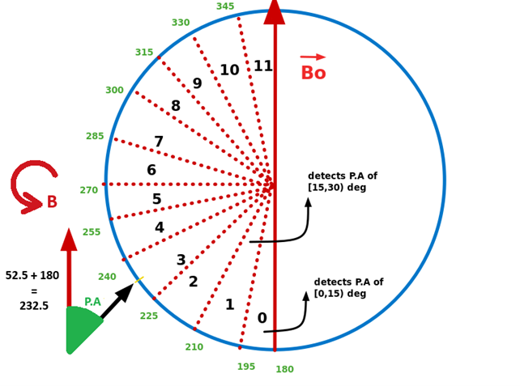
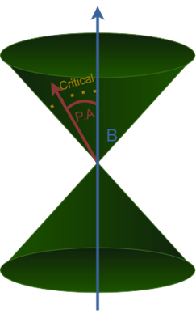

# Simulation of Wave-Particle Interaction with Parallel Processing


## Table of Contents
- [Features](#features)
- [Workflow](#workflow)
- [Distribution](#distribution)
- [Adiabatic Motion](#adiabatic-motion)
- [Satellite](#satellite)
- [RK4](#rk4)
- [Ray](#ray)
- [WPI](#wpi)
- [Parallelism](#parallelism)
- [Installation](#installation)
- [GUI](#gui)
- [CLI](#cli)
- [Acknowledgments](#acknowledgements)

## Features 

- Different methods for generating **particle distributions**
- **Parallel execution** of the wave-particle interaction simulation in **C++** and **export results in hdf5** format
- Load results in **Python** for **further processing and analysis**
- **Various visualization methods** for the particle distributions while they interact with waves, using **matplotlib**
- **PyQt application** for the above: configure, simulate, and visualize the interaction

Ultimately, the effects of various propagating waves over different particle distributions could be evident.

## Workflow

To better understand the code structure, a flow diagram has been created.

**Click on the image if you wish to use the hyperlinks to easily browse through the code in GitHub**.

[](https://viewer.diagrams.net/?tags=%7B%7D&highlight=0000ff&edit=_blank&layers=1&nav=1&title=code.drawio#R7V1rl5s2E%2F41Pqf9YB%2Futj%2Bud7NJmuTt5t70iw82WpsGIxfwXvrrX0lI3CSwjAHjjd3TDQgQQjPzzGhG0gz0683T68Derj9AB3gDTXGeBvrNQNOmuoH%2B4oLnuGBiTeKCVeA6cZGSFnx2%2FwP0QVq4cx0QxkVqXBRB6EXuNl%2B4hL4PllGuzA4C%2BJi%2F7R56Tq5ga68AV%2FB5aXt86XfXidb0I7RxWv4GuKs1e7Nq0YYv7OXPVQB3Pn2fD30QX9nYrBr64eHaduBjpkh%2FNdCvAwij%2BGjzdA083Kmsw76%2Fff7uvf9pvf7jY%2Fiv%2FXX27sv%2Fvg3jym4PeST5uAD4Ue2q%2F5l%2B2n4wlI8zDf6Nnpz63xb%2BUKNUfrC9He3KgWZ56C2zRYC%2FOXqmXWz9u8MfOruHfjQMCf2v0A2TLeKgWXoZHa3ov6SWnddELZ57TC0%2BeERXPRhGcS9G7tJDzNrod6J%2Bx41sstmhHSEKuhEYLgMYhsDJt14J7QdS5vroz583d1%2FIy4IdEq%2B%2Bf1pMkTBCX4j%2Bhfcd0wUVYr5khVruRVoEnkj3RwH8Ca6hBwNUTnABvd31vELROtp46ExFh49rRK3PW3uJa3pEOIvKHgD%2BLtu78tyVj4o3ruPgN80gunLvEUBZozLg04%2Bj2Dqhp%2BxtA01XyA8%2Fil7hRhipp0ryBXvhgcIIbhB4ysAmhYvXAG5AFDyjW%2BhVXbVGYzN%2BiqoFQx%2BPNFr0mAKtOqYYuc6A7JTeZ1NsXyUvSFEKHVCgOgS0xqWgJQ83DWANVwXjYfIBNRi5LRHk6rW9ANjOcyOo2Fmjj4S4ztrZFKxdMK0FTFN1lcM00%2BIBTTV5QDPHowYgbT4M%2F975X2fw8zfn9uNuPH769m6oKxzJgIMsXHpKyULsVIDrIT0WRGu4gr7tvYdwS8n1D4iiZ9rd9i6CeWKCJzf6iz6Oj3%2FgY%2FRR8dnNU%2BbSzTM78dEH%2FpXeiE9%2FZK%2Blj5Ez9lyG7qp2MEVDuAuWoOI%2BnY4y7GAFaH0%2F3m3Dv4w3cLIM5kPzg%2F9xtwuGJr0Rd2clgwTAsyP3IT%2BgEBGaPHoVBPZz5oYtdP0ozNR8hwsyfGdxfIdYscA3caUpFyWtk2Ksqm4SqErHfShiiI0ZPgD3OWRaRxEexF3hhmq3Kzda7xajJdygk2926C7XdqCiD7m9o0g3%2FBIgSfZXw1eoYI0uLDy4wG23saF6GwZL9Bf1DQi2EPc4xKWfkDqaf7Kf598DBDej5ZJHP9EtDPlsARrmvq8gW6kglUFcRmiKjLzy7DCkTB4DKhty4ruTUaJSgFYEdvcm%2Fo%2FDYXTFIj8eHuNfm3iocHw5EcChJrDvTKUlMDQm3YJhAoA%2FMlfOCgzHsmBoNg2GsoSuanbfwMlxkXy6ix3FpuypEJn4G0pxCVt%2FZ4VUZXhUjmBtIZVhnhSphPJkWJVIlYLSq7T0NMB1HADtBRajFSOLs6J0nfNIaFMrX0sMlvTBAn0PM6iEzofxKSmuDrq12w%2B3PLKqqopTshwl7OfGzfajXE5q9fisbUH%2Fdcg%2BORXZq1pdbaCgT3oYmDNtYN6ge37z3Pnj1h1o6I3KAr0Dn%2F1eX%2F%2Bv4WaxC%2Ffr%2Frw2R8S8tTeuh6n7BngPAPtrBGrAph6cJcADMrGZsCUWEzqz0rMvhINR%2F%2FCWw2QJkA0ksBAWE9Mw2%2FTtICMkcU5T7aBrvImgKSpvIozbMhFYhFTAQ91ZtA9uuEOk%2Fo8Nt%2B9gGM23AVyCMETPzm3fmd95MApH22feviV335XeLTB2L0ZsCYtaisYZMAy9cvGUKc%2BiqtIWj%2BoVUeAiXiWO5wWpOKF%2BUh6jX1K%2BKOUK6pPOYpike5pDrVKHtIjX8mr5OMP4gOGLxpmuyJrlKG8Jhi96a3QvxyYuvpDQkek3EYV5bvjFqa5OJpxK6pDqQvca84h35F7reMwyad52Ze6DrPFa5c86cajBVPkQV7ORBjFbGZ2yVcdjolOyVW8jWJ2w1YsOBrTIVifwxSEWydcSs3YTvrjKT60en392NzsWaMTdbKPXgiCUH5KfNCSxBrZDWnu7hH4Y2UhGR2t%2BjJa%2FWDcuiucbbsMyE6pikFYced3fa2IngGMtLLPNERYCJZ4t%2BQHWtMuApl4dJugHhuUQLAW01gOalbM29voL1cYjmk0pR23cgXY0urXlFTyYqaEetRMFy4%2FjrX75os2DpvLgPszxRclEQ1WrmmmYDOPT%2BTrAmSMuHq0RsyuVKlQ0QzFu1UEqKVzbW3yIFbfnAQ%2BukAJHN25B4BJFXrx2l17Yq8XcJ8DWskhoNccEE8cQabWJttBb9RtOBbaWQKvpAq1mtDZNp1ut1nXssw3kMXnkqQwanFirWVPOW63SORe38o%2BweEuritDq2MSqw4xqbROrjWFiO4YTP0wUQNekMGWj7WGieULN2Uy1uSlmWPdWKN4SJXvRx01Gc4zTKmQhn1v8dIVr1IOuvwOkWdi7oERrfOLZYcyN4qUqvY%2FZqC3SVuDY0hXJmYZNBG2GP15vd%2F9ezYLp%2Bi20besO7IZDkaerRDIje0F6dLl2Pee9%2FQx3EStlZ3iNUsA608Cdu4SeZ29DlzxKujsAy10QIuD%2FBGJ0oppta%2Fs5itAGtEmRqVIkiKlPR5MJRxOdLeXJ0gTBQRPrdoRkUTmy%2BJBER6to8wlPWJitYeD%2BhzrQ9gZsckOBJuGju%2FFsH7wBNutxVjSDDjMTImK64CMP3Ef0cAGjCG4YJWlf4GMngNsvzPwszpmgQtsSL1Ty9X5eYDEHRY7q07aGPRY%2Fa31j%2F8Qo6rionyJEVgGEMsJJkzXbn7GAkp0T7JQoAsp1JdaVsiCvRHlSqsqBpKSVf8Jd4688UKM620OqyUeKcIbVTXikBSruGtFEiwKHMM343l4A7w6GLolY6DdMlDnVSQS%2FMAWQgMzmaYX3%2BBgtcLhhhJ75ydtOpnZ7a4qHuNVcL69GzRGNDyagLRLdEeubTtSoViq7yKK5CK0EWVWDN4WEq%2F9rC61Mbc3KrJDjxxImV29ktpLZ5Wk7HhlK9mf1TX55HziVX%2BLYuojvXhKLgqHnLr7CnuHHwpRTogCNMS9YL8UsggV2L5JZNNFCj7PCeuNQ2hKsn6Y%2Ftt9bf7Ce99rGU84vQ%2BuWhtaJt3Lf2JpN9Wx%2BbM1P9usel7uGZVOaTgeOm6vIVGPcXKyuCxuc96%2F1F5crOfqYcbOqnRyLrf10uAhq7bFyfUGVqa0L%2B%2Bmc5LSSweVpOx1Np%2BX2Uw9kVrS7ykVmmxogn73MitZ8XtijqSHx2bOHJppuelaQfrDltWdI3ANI58NI3iXW3OKAeGIISC4aGrW1Lyjbpv6XAuWpNJ0OHRBXkKnOgLhQXRcDYu2MULmSo48aEPM7ZnSNxKpEdPAiqfVHxLUlVaa2Lsyns48eq%2FLqsmRIXJwg2wOplfBTXKS2%2Fpj47KVWtFLgvKT28Ak9e0Y9PZBaCaPnIrX1XRVnL7XnZBRXc3hzvgo25b0buRWa%2BqoioW6B71zhBHADUfKR0gUg04Egk8h0SjKJiNfbJSclq%2B1EK%2Fuq17dL0pbtHJtZkFcl39m1oVX17V23lyG8KZJTWnbk8j6tMEdQHadrNfbsyMzXZRbq0vi6SpYKSq9sTXaNTqoua406zrdG4hHd3PfI0YtfS0x1XtCu4QazJir04fe7t0P0f6XSzGg2TSm6DNVYQUa264Pgy3PsXgwAftAHj5k9j28G41m6ejFdgZsuaMSLHJPr3gJmns6serxOT0jLYogQ1xKnbBQ%2Bm4CL1JPjGx7Jb8lPKO0NrSS0uNVmpmmKkqxpE%2BGCs%2FY8HBJqNbvGukBNSl50ganWPDETvOc1QB72ZXUoE4K9SKsqgt2oS%2B48WcKMkvZIRGVePE2sjmjyNQTBn4t%2FcL5avGIWGY6sxw9c0q2LlnR%2FtjdgkK66HeD1Y9m8IyWLtEkfIej9RPLOZj5sD%2BMYmT6irJbhmT0Ls7llvLgFt9Bz4o3BVVryAT6kBb%2BuYtijo6VVA8P78pWPwjXI1uEaAZ1mmP0gQNqzt0Jd6WhGxojpM8D5pIPBnu2KZLZC6M13RS%2FnU0KADEunejfGGttUHApopfsSXJCu1jYbTWGglsdAVRjqbQYEZRGvekPaHuV8ai8VzNHGniVt7DW%2Bp%2FaR1BfNhO4NmL5YfTen22q8oG8qKL6Lmnv5Br1q9U%2Bb7cnBeVoZyaDZeQp5NH%2FhsHWx13sHZCe114sQlxjwJ4S48ixHO09GECZV0uTV3ulRWC1%2BkjykZG2eGTmPz8JsOoPI3YBRHVnkm930hyTNzzUY70KIt6BDRMOSbC%2FJjpY9%2FYKS9rfSeFSIubE6a5bstosZ5BQBayl4QnTl3iNu%2FzUqA%2F7g%2BNGgPHYMC4N9TeGDYMLEDa3t9cbmHfcwcUNzW1VXpd%2FNDtDFczxONTyvanXfEsqzLWduWT5YYRr5%2FEXpFC7Hb2SsSG1kHPsUokLyv4Z3FY5hzoG7RTI9rnbyUF1gGtlgci%2FMS2MtJ2Bxf7AcHZa%2BvpAJ0BDuKitITttaYho2%2Fuwhvp0%2BMU1VTpDucfGwaU7laWlMtdnd%2BKt6qbc4HOcwFaJw9tIFg18WBiOblEthKLuzdxMYLM5gVW60SHOPmuceZZl0alqo4w0dp1Oey9hu%2FaXcIx6L9Gg3eMxlECemjzBVDfEEpYZYiJ%2Bupwvm2Xea0Ld6CljLAcl6aXkO0%2BkN63CWM26vEm88k%2BZxQHFQGpMTaFUflmrV7KXealXqsLro1UNBURtzoKgJFvp2rFfLI%2FUXvdo7vSpiIa07vSrkIOEWOAcF4rBfWZ%2BVweFvv0sgX%2F2X1HGC5%2Bsp53ccwSm%2BryJKq8Sjql%2Fog5kzr%2FyTS7TEcrcoE9QMMiximX2%2FSArs5c8VkeQ%2Fd5Hn%2BkzDOHbw889EhJWRYuYLNVJaUC%2BTgWB1HQG5LB5MW8UDPsGWYfJLkYWhxCZ24xEDgsQ20ZmVE0vPDpFRNZBb0qiJO50saSyAcGZin6IYeVtas%2FZZ0%2BQsk5Wthom9N3Uug86erFLEqxKLzleWru3gVYq6tbeug1cpHrEkWtz%2FEhsZ1ObUEngQcSq2aVL40QvMaxnjPPPqil6HeVP%2F8tTIepixNBiDyhEpOjlOFPaONjXZdNOabL7pbmRGFyBwXZkxNEFdhRYdu7KXNZs3JFmzS5ft8ilKC48c7SUXxwj4zd1emOOmuWBMlX%2FmBOmUj%2FLXibaGKrgkqL8kzfSad0eU2I6XnKzFIaTIZOw2Sfq4Usb7mCR9304ZLQu1wMQ8sxzpTYdYq7qpCkQWMFpfIORICDGmp4YQtqlIrydp1F5hNml%2B8Kk2vmlDid3IJ4pOtkvbYyE3hQLjchdldjZpcX4sSYVGfGCLnevh2fwKQFLyHK3xLHm5ObbZxJn5qhBnZTYzyG5yEJKp7krBUVfidCPbOXFON%2FAElugZhBn0C%2BLMnfLVin15wc5nLd8G0Nktixsy5IFUFAZqavJyJqMhmflvbzCe%2BotwO4hdi7l%2BJjORt9CLE7kT3dV4F3O1Fj5M2HmZhjlzVEOmA4U9JdElNNIo4DY6RzvZ7oi09Rb9JceNdwgLeV4fw3K4Y0UdR8KQpLfoN%2FB6vHn2k5p%2BfkRoKt4vvqHA1OE6Q94EsLhpmuPxZKQLcs2LZqKbahOp5kt20xN5n2PqbQeicAcOAwxZ6zDbKiOrPGqCGrU9IiDTSDSGl7wRUkcK%2BpDdE67jOYzABh0MsdSswTOxBgg0IJtgtwHEUidXQ4BLP726uvnwarRx0DEJ8t9DDy9v0JTr928HLGM7Qvfj17P1pMNkAGl6dT2e3ZY%2FG25tX9iANMg0pBUT7bBa%2FKYQsMI4mzn6faDF%2FlSF40QVcyK9WPisaclnFdTgvvMi4O%2FtTuF7qeJJqo%2F%2FcqfKCLMDMUTk7kX6cB7bklK3M31TFm2s5N6YnLJMfeH1M%2BT1LbLcoY%2FGAsodDKP5XQCXIAyRLT%2B3fWd%2B50GCi2IhKZObTnmpET6Qxm5Oz%2BV1X9%2Fn5Qg3v6Xxt7bMIj1vE0306WjC20SGkew73M0OwzJpOOrtMCwMcl5f1%2BjknsTz0r1oUyIig1CX8lfwET3eUyaqrqGgnqDt4%2BRlhzSRe6ol56wwIeZl8mFPJx8aJsdfJ5%2FUrzIkE7BQF3O7PyDLlzg8ytVtXSWumiItnnnhHvuBe3F%2BMnkvOZtsHztLbMriyzN8z%2BSgenaN3urkO33CxbQE87nbkod3cGg8qV%2Fh7dfAUP748biFVlARND%2FBSgdcKlznkF7Yz5i1J%2F%2FjmNkKz9gasGSOmJ%2B%2FU8LQXBUOMXiUAmcjZro38X88k8U%2FTjzw%2BgHya5Pf%2BDk7qiUIuzW0fgCPv8nuyanKxxk9PkAH7%2FD86v8%3D)


## Distribution

Various distributions can be created:

Example distribution of 100,000 particles:
- latitude(lamda) - normal distribution(mean=0deg)
- equatorial pitch angle(aeq) - normal distribution(mean=90deg)
- energy(Ekin) - uniform distribution
- gyro phase equivalent(eta) - uniform distribution

 

- Plotting number of particles in Pitch Angle equatorial sectors of 1 degree
- Initial equatorial Pitch Angle - Latitude plot 


**lamda is latitude, not L_shell**

## Adiabatic Motion

When there's **no interaction with a wave**, the particles are following an adiabatic motion and they are bouncing between their mirroring points indefinitely. 


The Fast Fourier Transform (FFT)  can be derived to validate the simulated motion, transforming the signal from the time domain to the frequency domain.


- The red line represents a theoretical calculation of the frequency of the bouncing motion [Orlova1,Shprits2,2011].
- The green one from the online calculator [https://solenelejosne.com/bounce/] uses the same parameters for the particle (L_shell, energy, and particle type) as our simulation


## Satellite

The sensor's pitch angle coverage together with the sector division are parameters of the post-processing program.
Below you can see 12 sectors of 15 degrees.
Detected particles will belong to the corresponding 
This gives full coverage(180deg) - Omni Directional Particle Telescope(ODPT)



Bo: the vector of the ambient magnetic field is used as a reference


## RK4

As the numerical method for the estimation of the particle variables, a fourth-order method of [Runge Kutta](https://en.wikipedia.org/wiki/Runge%E2%80%93Kutta_methods) has been used


## Ray

Ray data is then interpolated to match the time steps of the Runge Kutta method
The wave here is 2KHz


## WPI

### Particles that interact with the wave can gain energy and reach the satellite in a given location


### The wave-particle interaction can cause equatorial pitch angle change and can therefore enter the loss cone



Then the particle will then precipitate and escape to the upper ionosphere:
1) Exits the simulation
2) The satellite will no longer detect it

### In consequence, the particle sum decreases after interaction

- The red dots sit upon the black dots for the first 50 seconds
- Moving on, the red dots can be seen in lower positions since the total flux is being reduced
- x-axis: Time, divided in bins of 0.5seconds
- y-axis: Total flux: the sum of all the particles (all look directions) that the sensor detects


### Movie gif file

*Pitch Angle and Time bins are parameters in the postprocessing program.*


**Particle Pitch Angle distribution across a 1-minute simulation for 50000 particles**
- 50 seconds Adiabatic motion to randomize the motion of the particle population
- 5 seconds Wave-particle interaction
- x-axis: Pitch angle bins of 2 degrees 
- y-axis: count of the particles that pass the satellite(equator) across time.
- Every time frame is 0.5s(time bin) of the simulation. 
- Gif starts from the 45s of the simulation, to simplify the video.
- The red dots are for the WPI simulation, while the black ones are for the no WPI simulation. 
- t<50s Black dots are sitting on top of the red; since both of the simulations are simulating the adiabatic motion.
- t>50s WPI happens in one of the simulations and we can identify the difference
- The blue bars are showing the movement of particles in the neighboring Pitch Angle bins. We can see that most of the movement is happening between the sectors 40-50 i.e. 80-100degrees P.A.


## Parallelism

### OpenMP
**Selection of THREAD NUM**
In the master branch it is hard coded for a reason

**Personally, I was executing 2 simulations in parallel, in a system with 20 Threads, both for time "t"**

e.g. Run simultaneously 2 simulations:

- Simulation1 "./tracer 10 5" (The program arguments here mean: 10 seconds for noWPI simulation and 5 seconds for WPI simulation)
- Simulation2 "./tracer 15 0" (The program arguments here mean: 15 seconds for noWPI simulation)
- Ultimately, there are two 15-second simulations

Both of the simulations need to run. Eventually, we can find out what is the effect of the wave-particle interaction

- Simulation1 for noWPI(8threads) + WPI(20threads) for t = t_noWPI + t_WPI 
- Simulation2 for noWPI(8threads) for t = t_noWPI

This selection of threads can ensure that the processors have always work to do, while the simulation's execution time per particle is kept little.

This we can see by reviewing the following diagram that discusses the scalability of the program.

### Visually

**Simulation 1**
start------------|t_noWPI(8threads)|---------end-start------------------|t_WPI(20threads)|----------------------end

**Simulation 2**
start-------------------------------|t(8threads)|-----------------------------------end

**Simulation 1+2**
start----------|16 threads in use|--------end-start--|28 threads in use|--end-start---|20 threads in use|---end


## Installation

There's support only for Linux at the moment. The installation procedure is given below, step by step. Start with the dependencies, continue with cloning the repository, then install the Python requirements and finally continue to [Usage](#usage).

### Dependencies

The commands are given for Debian, Ubuntu, and related distributions. If you have different distribution and/or different package manager, the commands are different but should be as simple as the ones that are listed below.
- libhdf5: ```sudo apt install libhdf5-dev```
- HighFive - HDF5 header-only C++ Library (which is a git submodule to the repository, so you don't need to install explicitly)
https://github.com/BlueBrain/HighFive
- g++ compiler - with OpenMP support (if you want to run in parallel). Compiler g++ is most probably installed in your linux system 
Update package manager: ```sudo apt update```
Install g++: ```sudo apt install g++```
To show version```echo |cpp -fopenmp -dM |grep -i open``` shows the version of OpenMP.
It should give an output like "_OPENMP yyyymm", where yyyymm are the designations for the year and month of the OpenMP API version
- python3  : python is most probably already installed but if not: 
Update package manager: ```sudo apt update```
Install python: ```sudo apt install python3```

### Clone Repository

Close the repository: ```git clone https://github.com/Vasichar11/Particle-Tracing-Earth```
Take note that the repository includes a git submodule for hdf5 file reading and writing operations:
https://github.com/BlueBrain/HighFive

### Requirements

There are a few requirements for python, listed in the requirements.txt file
- Create virtualenv: ```python3 -m venv tracer_venv``` (Name the environment 'tracer_venv' to correctly ignore it when using version control)
- Activate: ```source tracer_venv/bin/activate``` 
- Upgrade pip: ```python3 -m pip install --upgrade pip```
- Install requirements: ```python3 -m pip install Particle-Tracing-Earth/requirements.txt``` 


### GUI

```python3 Particle-Tracing-Earth\tracer.py``` (Python requirements need to be already installed for the PyQt application to work)

**Configure** the simulation **parameters** in the GUI. **Validation will occur**, using XML-XSD pairs.
Then you can **build the simulation and execute** it. The results will then be then visible within the GUI and also saved in the output directories.


### CLI

1) ```make allclean``` cleans all simulation output data and object file
2) **Modify the constants.h header file** that includes all the parameter values for the simulation
3) **```make dstr```** -> To build the distribution
**```./dstr <arg1> <arg2> <arg3> <arg4>```** -> to create the desired particle distribution where:
- ```<arg1>``` refers to the Pitch Angle (P.A) distribution 
- ```<arg2>``` refers to the Latitude distribution 
- ```<arg3>``` refers to the eta distribution 
- ```<arg4>``` refers to the Energy distribution 

These arguments take values from this list: (normal,uniform,evenly,constant). 
As the names suggest:

- normal is to create a normal distribution for the particles on the corresponding variable
- uniform is to create a uniform distribution for the particles on the corresponding variable
- evenly is to distribute the particles in evenly i.e. with a fixed step within a range on the corresponding variable
- constant is to distribute the particles in a constant value
 **Will produce the file "output/files/dstr.h5".**
Consider jumping to step 6 to **visualize the distribution** before running the simulation.

4) **```make ray```** -> to build the ray interpolation
**```./ray```** -> To execute the ray:
interpolates the ray values of the input (a file that comes after ray tracing of the wave) using the stepsize of the simulation. 
 The stepsize "Simulation::h" which is within the constants.h header file is the timestep of the particles in the simulation. In every step, we need to test if the particle is within the wave range. If yes, we need the values of the wave in these time frames to simulate the interaction. Running this executable will interpolate the ray data based on this timestep.
 **Will produce the file "output/files/interpolated_ray_pwr.h5."**
 Consider jumping to step 6 to **visualize the ray** before running the simulation.

5) **```make tracer```** -> to build the tracer for the WPI simulation
    **```./tracer <noWPI_time> <WPI_time> ```** -> to execute the WPI simulation where:
- <noWPI_time> is the time that the particles oscillate in adiabatic motion (without interacting with a wave). This time should be enough for the particles to be in a randomized state
- <WPI_time> is the time that the particles have to interact with the wave while bouncing in the Earth's magnetic field. Take note that this time should be much smaller than the noWPI_time since the execution of the WPI code consumes more resources than the adiabatic motion simulation.
You will be prompted to choose from the files you created earlier:
- a particle distribution file: "output/files/dstr.h5"
- an interpolated ray file: "output/files/interpolated_ray_pwr.h5"
 **Will produce the file "output/files/sim.h5."**
6) Visualize
- **```python3 src/visualization/distribution_plot.py```** to visualize the initial distribution. 
Reads: "output/files/dstr.h5"
- **```python3 src/visualization/Ray_plot.py```** to visualize the ray electric and magnetic fields and latitude 
Reads: "output/files/interpolated_ray_pwr.h5"
- **```python3 src/visualization/Post_processing_and_Plots.py```** to make the binning process and visualize the results of the simulation
Reads: "output/files/sim.h5."

7) Visualization files have been created in the output/plots directory

## Acknowledgments

The initial simulation for single particle WPI was implemented serially in Python by Ph.D. candidate Stelios Tourgaidis.


